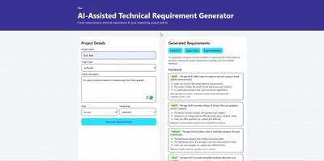

# 📌 AI-Assisted Technical Requirement Generator

  
*A quick demonstration of the AI-powered requirement generation process.*

---

## 🚀 Overview
The **AI-Assisted Technical Requirement Generator** is a web application that helps engineers, product managers, and students **instantly generate structured, professional technical requirements** for projects.  
By simply providing **project details**, users receive categorized requirements (Functional, Performance, Safety, Compliance, etc.) in a **clear, exportable format**.

---

## ✨ Features
- **AI-Powered Requirement Generation** – Uses an intelligent backend to create precise, categorized requirements.
- **Multiple Output Formats** – Export results as **PDF, DOCX, or Markdown**.
- **Customizable Inputs** – Define:
  - Project name  
  - Project type (Software, Mechanical, Electrical, etc.)  
  - Project description  
  - Tone (formal/informal)  
  - Detail level (brief/detailed)
- **Attractive, Responsive UI** – Clean layout with modern Bootstrap styling.
- **Fast & Seamless** – Generates outputs within seconds.

---

## 🛠 Tech Stack
**Frontend**
- React + TypeScript
- Vite
- Bootstrap / Custom CSS

**Backend**
- Python (FastAPI)
- Uvicorn
- AI model for requirement generation

**Utilities**
- `file-saver` for file downloads
- `docx`, `reportlab`, and Markdown libraries for export

---

## 📂 Project Structure
```
Projects-Requirements-Generator/
│
├── mai-backend/         # FastAPI backend for AI requirement generation
├── mai-frontend/        # React TypeScript frontend
├── .gitattributes
├── .gitignore
└── README.md
```
---

## 🔧 Installation & Setup

### 1️⃣ Clone the repository
```bash
git clone https://github.com/MuhammadSaqib786/Projects-Requirements-Generator.git
cd Projects-Requirements-Generator
```

### 2️⃣ Backend Setup
```bash
cd mai-backend
pip install -r requirements.txt
uvicorn main:app --reload --port 8000
```

### 3️⃣ Frontend Setup
```bash
cd ../mai-frontend
npm install
npm run dev
```
## 🐳 Run with Docker

Make sure you have **Docker** and **Docker Compose** installed, then run:

```bash
docker compose up -d --build
```

This will:
- Build the **backend** (FastAPI + Python)
- Build the **frontend** (React + TypeScript)
- Start both containers
- Map ports so you can access the app in your browser

Once running, open your browser at:

```
http://127.0.0.1
```

The frontend will connect to the backend automatically inside Docker.

---

**Check Backend API Health:**
```
http://127.0.0.1:8000/api/health
```
If it returns:
```json
{"status": "ok"}
```
then your API is ready.

---

**Stop the Containers:**
```bash
docker compose down
```

**Rebuild & Restart:**
```bash
docker compose up -d --build
```

---

## 📄 Usage
1. Enter **project details** in the form.
2. Click **Generate Requirements**.
3. View categorized requirements instantly.
4. Export in PDF, DOCX, or Markdown format.

---

## 🎯 Future Improvements
- Integration with **OpenAI / local LLM models** for more accurate results.
- Save projects for later editing.
- Multi-language support.
- Custom export templates.

---

## 👨‍💻 Author
**Muhammad Saqib**  
- 📧 saqisaqi.sk@gmail.com  

---

## ⭐ Contribute
Contributions are welcome!  
Fork the repo, make changes, and submit a pull request.
